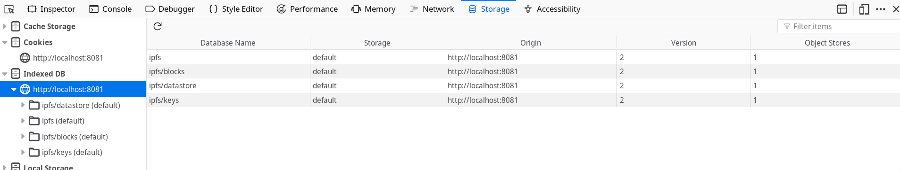
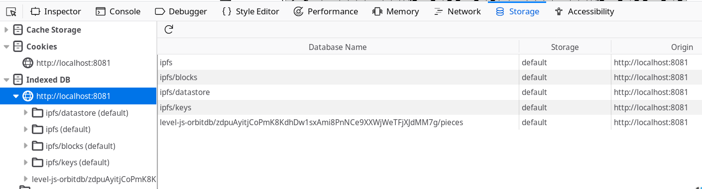

## Chapter 1 - Laying the Foundation

> The basics of OrbitDB include  _installing OrbitDB (and IPFS)_, _setting up a new isomorphic project_, _creating databases_, and how _understanding how to choose data stores_.

<div>
  <h3>Table of Contents</h3>
  
Please see the [Introduction](./00_Introduction.md) before beginning this chapter.

- [Installing the requirements: IPFS and OrbitDB](#installing-the-requirements-ipfs-and-orbitdb)
- [Instantiating IPFS and OrbitDB](#instantiating-ipfs-and-orbitdb)
- [Creating a Database](#creating-a-database)
- [Choosing a data store](#choosing-a-data-store)
- [Key takeaways](#key-takeaways)

</div>

### Installing the requirements: IPFS and OrbitDB

You will need to get the code for OrbitDB and its dependency, IPFS, and make it available to your project. The process is
different between the browser and node.js, so we cover both here.

|||
| ------ | ---------------------------------------------------- |
|  | Both OrbitDB and js-ipfs are open source, which give you the ability to build and even contribute to the code. This will be covered in detail these in Part 3. |

#### In node.js

Choose a project directory and `cd` to there from your command line. Then run the following command.

```bash
$ npm init
... enter commands to create package.json ...

$ npm install orbit-db ipfs
```

This will create a `package.json`, `package.lock`, and `node_modules` folder.

> **Note:** If you're running on a windows prompt, or if you don't have certain build tools like `g++` and `python` installed, you may see a noisy console output with lots of warnings and errors. Keep going, your code should still run.

#### In the Browser

If you're using the browser for this tutorial, we recommend using unpkg for obtaining pre-built, minified versions of both IPFS and OrbitDB. Simply include these in your HTML:

```html
<script src="https://unpkg.com/ipfs/dist/index.min.js"></script>
<script src="https://www.unpkg.com/orbit-db/src/OrbitDB.js"></script>
```

You will now have global `Ipfs` and `OrbitDB` objects available to you. You will see how we'll use these later.

### Creating the isomorphic bookends

Since OrbitDB works in the browser and node.js, you're going to want to make the library as _isomorphic_ as possoble. This means we want the same code to run in the browser as runs in JS. Luckily, you will have the luxury of using the same language, JavaScript, for both node.js and browser environments. 

Create a new file called `newpieceplease.js` and put this code in there:

```diff
+ try {
+   const Ipfs = require('ipfs')
+   const OrbitDB = require('orbit-db')
+ } catch(e) {}

+ class NewPiecePlease() {
+   constructor(IPFS, OrbitDB) { }
+ }

+ try {
+   module.exports = exports = new NewPiecePlease(IPFS, OrbitDB)
+ } catch (e) {
+   window.NPP = new NewPiecePlease(window.Ipfs, window.OrbitDB)
+ }
```

In the browser, you can include this file in a script tag and have an `NPP` object at your disposal. In node.js, you can simply call something like:

```plain
$ node

> const NPP = require('./newpieceplease')
```

Not much should happen either way, since there's not much code there yet. For now just make sure you can create the `NPP` constant.

#### What just happened?

Using some key JavaScript features, you have created the shell for our application that runs in both node.js and the browser. It defines a new class called `NewPiecePlease`, with a constructor that takes two arguments

1. `IPFS` for the `js-ipfs` constructor
2. `OrbitDB` for the `orbit-db` constructor

From here on out, we will ignore these isometric bookends and concentrate wholly on the `NewPiecePlease` class.

### Instantiating IPFS and OrbitDB

OrbitDB requires a running IPFS node to operate, so you will create one here and notify OrbitDB about it. by running the
following code. It's a lot but it constitutes the frame for an _isomorphic_ JavaScript app, that is, one that runs in both the browser and in node.js with the same code.

> **Note:** We have designed Chapters 1 and 2 of the tutorial to work work offline, not requiring any internet connectivity or connections to peers.

```diff
class NewPiecePlease() {
-   constructor(IPFS, OrbitDB) { }
+   constructor(IPFS, OrbitDB) {
+     let node = new IPFS({
+       preload: { enabled: false },
+       repo: "./ipfs",
+       EXPERIMENTAL: { pubsub: true },
+       config: {
+         Bootstrap: [],
+         Addresses: { Swarm: [] }
+       }
+     });
+
+     node.on("error", (e) => { throw (e) })
+     node.on("ready", this._init.bind(this)) 
+   }
+
+   async _init() {
+     this.orbitdb = await OrbitDB.createInstance(this.node)
+
+     this.onready()
+   }
}
```

This allows you to run something like the following in your application code:

```javascript
NPP.onready = () => {
   console.log(NPP.orbitdb.id)
}
```

In the output you will see something called a "multihash", like `QmPSicLtjhsVifwJftnxncFs4EwYTBEjKUzWweh1nAA87B`. This is the identifier of your IPFS node.

#### What just happened?

Start with the `new Ipfs` line. This code creates a new IPFS node. Note the default settings:

- `preload: { enabled: false }` disables the use of so-called "pre-load" IPFS nodes. These nodes exist to help load balance
the global network and prevent DDoS. However, these nodes can go down and cause errors. Since we are only working offline
for now, we include this line to disable them.
- `repo: './ipfs'` designates the path of the repo in node.js only. In the browser, you can actually remove this line. The
default setting is a folder called `.jsipfs` in your home directory. You will see why we choose this acute location for the
folder later.
- `XPERIMENTAL: { pubsub: true }` enables IPFS pubsub, which is a method of communicating between nodes and is required for OrbitDB usage, despite whether or not we are connected to other peers.
- `config: { Bootstrap: [], Addresses: { Swarm: [] }}` sets both our bootstrap peers list (peers that are loaded on
instantiation) and swarm peers list (peers that can connect and disconnect at any time to empty. We will populate these
later.
- `node.on("error", (e) => { throw new Error(e) })` implements extremely basic error handling for if something happens
during node creation
- `node.on("ready", (e) => { orbitdb = new OrbitDB(node) })` instantiates OrbitDB on top of the IPFS node, when it is ready.

By running the code above, you have created a new IPFS node that works locally and is not connected to any peers.
You have also loaded a new `orbitdb` object into memory, ready to create databases and manage data.

*You are now ready to use OrbitDB!*

##### What else happened in node.js?

When you ran the code in node.js, you created two folders in your project structure: `'orbitdb/` and `ipfs/`.

```bash
$ # slashes added to ls output for effect
$ ls orbitdb/
QmNrPunxswb2Chmv295GeCvK9FDusWaTr1ZrYhvWV9AtGM/

$ ls ipfs/
blocks/  config  datastore/  datastore_spec  keys/  version
```

Looking inside of the `orbitdb/` folder, you will see that the subfolder has the same ID as orbitdb, as well as the IPFS node. This is purposeful, as this initial folder contains metadata that OrbitDB will need to operate. See Part 3 for detailed information about this.

The `ipfs/` folder contains all of your IPFS data. Explaining this in depth is outside of the scope of this tutorial, and  the curious can find out more [here](https://ipfs.io).

##### What else happened in the browser?

In the browser IPFS content is handled inside of IndexedDB, a persistent storage mechanism for browsers



Note since you have not explicitly defined a database in the broser, no IndexedDB databases have been created for OrbitDB yet.

> **Caution!** iOS and Android have been known to purge IndexedDB if storage space needs to be created inside of your phone.
We recommend creating robust backup mechanisms at the application layer

### Creating a Database

Your users will want to create a catalog of musical pieces to practice. You will now create this database, and ensure that that *only that user* can write to it.

Expand of your `_init` function to the following:

```diff
  async _init {
    this.orbitdb = await OrbitDB.createInstance(node)
+   this.defaultOptions = { accessController: { write: [this.orbitdb.identity.publicKey] }}
+     
+   const docStoreOptions = Object.assign(this.defaultOptions, { indexBy: 'hash' })
+   this.pieces = await orbitdb.docstore('pieces', options)
  }
```

Then, in your application code, run this:

```javascript
NPP.onready = () => {
   console.log(NPP.pieces.id)
}
```

You will see something like the following as an output: `/orbitdb/zdpuB3VvBJHqYCocN4utQrpBseHou88mq2DLh7bUkWviBQSE3/pieces`. This is the id, or **address** (technically a multiaddress) of this database. It's important for you to not only _know_ this, but also to understand what it is: 

1. The first bit, `/orbitdb.`, is the protocol. It tells you that this address is an OrbitDB address. The last bit, `pieces` is simply the name you provided.
2. The second, or middle, part `zdpuB3VvBJHqYCocN4utQrpBseHou88mq2DLh7bUkWviBQSE3` that is the most interesting. This is the Content ID (CID) of the database manifest, which contains
  1. The **access control list** of the database
  2. The **type** of the database
  3. The **name** of the database
3. The final part s the name you provided, which becomes part of the 

> *Note:* Misunderstanding OrbitDB addressing can lead to some very unexpected - sometimes hilarious, sometimes disastrous outcomes. Read more in Part 2: Thinking Peer to Peer to learn more.

#### What just happened?

Your code created a local OrbitDB database, of type "docstore", writable only by the user that created it.

- The `options` defines the paramaters for the database we are about to create.
  - `accessController: { write: [orbitdb.identity.publicKey] }` defines the ACL, or "Access Control List". In this instance
  we are restricting `write` access to ONLY orbitdb instances identified by our particular `publicKey`
  - `indexBy: "hash"` is a docstore-specific option, which specifies which field to index our database by
- `pieces = await orbitdb.docstore('pieces', options)` is the magic line that creates the database. Once this line is
completed, the database is open and can be acted upon.

> **Caution!** A note about identity: Your public key is not your identity. We repeat, *your public key is not your identity*.  That being said, it is often used as such for convenience's sake, and the lack of better alternatives. So, in the early parts of this  tutorial we say "writable only to you" when we really mean "writable only by an OrbitDB instance on top of an IPFS node that has the correct id, which we are assuming is controlled by you."

##### What else happened in node.js?

You will see some activity inside your project's `orbitdb/` folder. This is good.

```bash
$ ls orbitdb/
QmNrPunxswb2Chmv295GeCvK9FDusWaTr1ZrYhvWV9AtGM/  zdpuB3VvBJHqYCocN4utQrpBseHou88mq2DLh7bUkWviBQSE3/

$ ls orbitdb/zdpuB3VvBJHqYCocN4utQrpBseHou88mq2DLh7bUkWviBQSE3/
pieces/

$ ls orbitdb/zdpuB3VvBJHqYCocN4utQrpBseHou88mq2DLh7bUkWviBQSE3/pieces/
000003.log  CURRENT  LOCK  LOG  MANIFEST-000002
```

You don't need to understand this fully for now, just know that it happened. Two subfolders, one being the original folder you saw when you instantiated OrbitDB, and now another that has the same address as your database.

##### What else happened in the browser?

Similarly, a new IndexedDB database was created to hold your OrbitDB-specific info, apart from the data itself which are still stored in IPFS.



This shows you one of OrbitDB's core strenths - the ability to manage a lot of complexity between its own internals and those of IPFS, providing a clear and clean API to manage the data that matters to you.

### Choosing a data store

OrbitDB organizes its functionality by separating different data management concerns, schemas and APIs into **stores**. We chose a `docstore` for you in the last chapter, but after this tutorial it will be your job to determine the right store for the job.

At your disposal you have:

- **[log](https://github.com/orbitdb/orbit-db/blob/master/API.md#orbitdblognameaddress)**: an immutable (append-only) log with traversable history. Useful for *"latest N"* use cases or as a message queue.
- **[feed](https://github.com/orbitdb/orbit-db/blob/master/API.md#orbitdbfeednameaddress)**: a mutable log with traversable history. Entries can be added and removed. Useful for *"shopping cart"* type of use cases, or for example as a feed of blog posts or "tweets".
- **[keyvalue](https://github.com/orbitdb/orbit-db/blob/master/API.md#orbitdbkeyvaluenameaddress)**: a key-value database just like your favourite key-value database.
- **[docs](https://github.com/orbitdb/orbit-db/blob/master/API.md#orbitdbdocsnameaddress-options)**: a document database to which JSON documents can be stored and indexed by a specified key. Useful for building search indices or version controlling documents and data.
- **[counter](https://github.com/orbitdb/orbit-db/blob/master/API.md#orbitdbcounternameaddress)**: Useful for counting events separate from log/feed data.

Each OrbitDB store has its own specific API methods to create, delete, retreieve and update data. In general, you can expect to always have something like a `get` and something like a `put`.

Also, OrbitDB developers can write their own stores if it suits them. This is an advanced topic and is covered in Part 3 of this book.

### Key takeaways

- OrbitDB is a distributed database layer which stores its raw data in IPFS
- Both IPFS and OrbitDB work offline and online
- OrbitDB instances have an _ID_ which is the same as the underling IPFS node's ID.
- OrbitDB instances create databases, which have unique _addresses_
- Basic access rights to OrbitDB databases are managed using access control lists (or ACLs), based on the ID of the IPFS node performing the requests on the database
- OrbitDB database addresses are hashes of the database's ACL, its type, and its name.
- Since OrbitDB and IPFS are written in JavaScript, it is possible to build isomorphic applications that run in the browser  and in node.js
- OrbitDB manages needed flexibility of schema and API design in functionality called **stores**.
- OrbitDB comes with a handful of stores, and you can write your own.
- Each store will have its own API, but you will generally have at least a `get` and a `put`

<strong>Now that you've laid the groundwork, you'll learn how to work with data! Onward, then, to [Chapter 2: Managing Data](./02_Managing_Data.md).</strong>

- Resolves #[367](https://github.com/orbitdb/orbit-db/issues/367)
- Resolves #[366](https://github.com/orbitdb/orbit-db/issues/366)
- Resolves #[502](https://github.com/orbitdb/orbit-db/issues/502)
