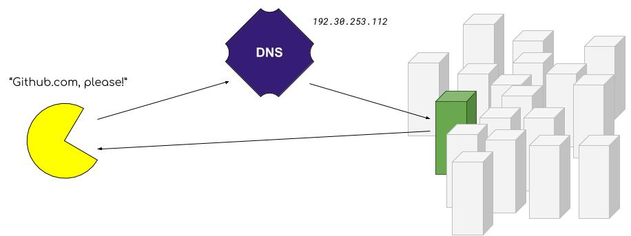
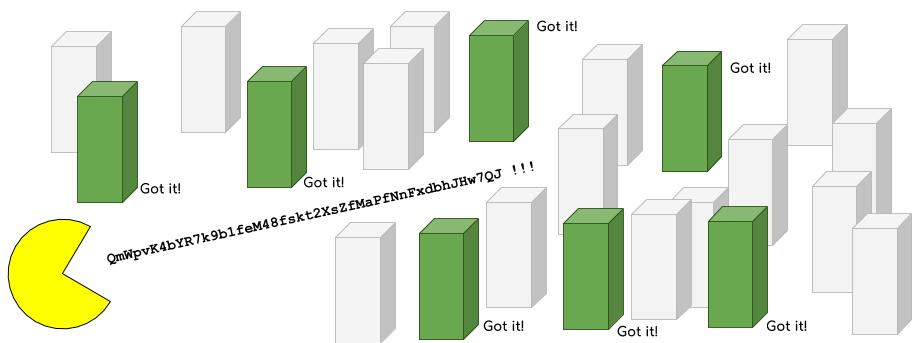
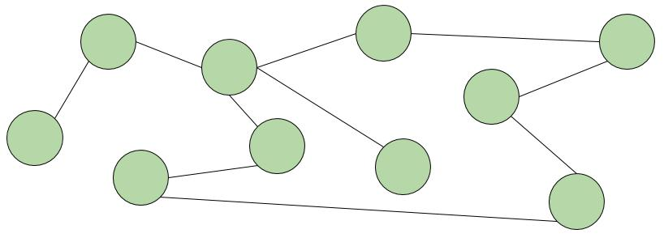
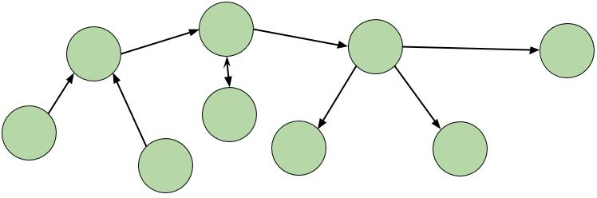
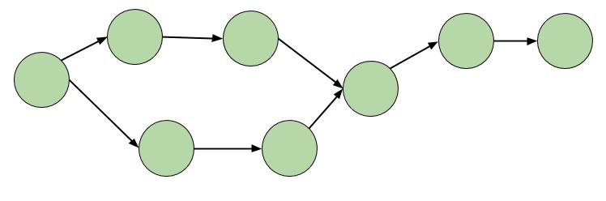

## Firmament: The Interplanetary File System

> In order to understand OrbitDB, you need to understand a few things about how the Interplanetary File System (IPFS) works. IPFS is unique in a number of ways, but the TODO most relevant to you are how it assigns addresses to data, and how _linked data_ structures are created.

<div>
  <h3>Table of Contents</h3>
  
- [Content-Addressed vs Location-Addressed](#content-addressed-vs-location-addressed)
- [Directed Acyclic Graphs](#directed-acyclic-graphs)

</div>

### Content-Addressed vs Location-Addressed

Most content on the internet is _location-addressed_. You type in a familiar name, such as [https://github.com/orbitdb](https://github.com/orbitdb) and that request is sent to the Domain Name System (DNS), which queries, cross-references, and determines which servers out of the millions  out there are the ones with your data on it. Then, that server would understand how to process your query, and send the data back.



In IPFS, your files are instead _content-addressed_. When you add content to IPFS, that content is given an address based on _what_ it is, freeing it from the constraints of its location. You simply ask for what you want, by its _hash_, and multiple servers can respond at the same time if they have the data.



Content addressing is achieved by a technique called _hashing_, which is a very oblique way of saying "chops up your data into blocks, sum them together repeatedly, and reduce the file down to a unique, consistently-sized alphanumeric string."  This is a process identical to generating a "checksum," if you're familiar with that.

For hashing algorithms, there are currently two standards in play: Content ID version 0 (CIDv0) and Content ID version 1 (CIDv1).

- CIDv0 hashes look like this: `QmWpvK4bYR7k9b1feM48fskt2XsZfMaPfNnFxdbhJHw7QJ`
- CIDv1 hashes look like this: `zdpuAmRtbL62Yt5w3H6rpm8PoMZFoQuqLgxoMsDJR5frJGxKJ`

> **Note:** These hashes are a special type called a [multihash](https://github.com/multiformats/multihash). In practice, this means they have self-describing prefixes. If you see something starting with `zdpu`, you know it's a CIDv1.

The two main reasons to switch to content addressing are _performance_ and _verifiability_. The performance boost comes from the fact that you can download files simultaneously from multiple peers, similar to Bittorrent. The hashes are also verifiable, meaning that you only download data you request. No other data can have that same hash.

#### Example

Let's take a very famous file, and add it to IPFS.  Here's the plain-text MIT license:

```plain
Permission is hereby granted, free of charge, to any person obtaining a copy of this software and
associated documentation files (the "Software"), to deal in the Software without restriction,
including without limitation the rights to use, copy, modify, merge, publish, distribute, sublicense,
and/or sell copies of the Software, and to permit persons to whom the Software is furnished to do so,
subject to the following conditions:

The above copyright notice and this permission notice shall be included in all copies or substantial
portions of the Software.

THE SOFTWARE IS PROVIDED "AS IS", WITHOUT WARRANTY OF ANY KIND, EXPRESS OR IMPLIED, INCLUDING BUT
NOT LIMITED TO THE WARRANTIES OF MERCHANTABILITY, FITNESS FOR A PARTICULAR PURPOSE AND NONINFRINGEMENT.
IN NO EVENT SHALL THE AUTHORS OR COPYRIGHT HOLDERS BE LIABLE FOR ANY CLAIM, DAMAGES OR OTHER LIABILITY,
WHETHER IN AN ACTION OF CONTRACT, TORT OR OTHERWISE, ARISING FROM, OUT OF OR IN CONNECTION WITH THE
SOFTWARE OR THE USE OR OTHER DEALINGS IN THE SOFTWARE.
```

If you copy and paste that , newlines and all, into a file named `MIT` and then add that text to IPFS, it will return `QmWpvK4bYR7k9b1feM48fskt2XsZfMaPfNnFxdbhJHw7QJ` every time. That is now, and will be in the future, the _content address_ of that file.

### Directed Acyclic Graphs

This is a _graph_ of connected _nodes_. Think of a network of computers connected via Ethernet cable. Ethernet is directionless; the computers are simply "connected."



This is a _directed graph_. Connections flow in a certain direction, but can be reciprocal. Think of users on a social media network that allows "following." You following another user is not the same as them following you, but following can be mutual.



This is a _directed acyclic graph_ or a "DAG". Connections only flow in one direction and never "cycle" or loop back.



Node connections are generally represented in data by storing a pointer to another node id. For example, modeling a twitter follow in JSON might look something like `{ id: "@your_username", follows: "@aphelionz" }`. In a DAG, a common and very effective way is to point directly to the CIDs - the unique cryptographic hash of the content you're looking for. This gives you the benefits of using CIDs in general: verifiability and performance, and also the added benefit of being able to _enforce_ the acyclic property of the graph - it is effectively impossible for any past nodes to predict the hashes of future nodes in order to store a pointer to them ahead of time.

> **Note:** This technique of using cryptographic hashes to link data is named after [Ralph Merkle](https://scholar.google.com/scholar?hl=en&as_sdt=0%2C22&q=ralph+merkle&btnG=), so this data structure is called a _Merkle DAG_.

#### Example

TODO: `ipfs.dag` example
