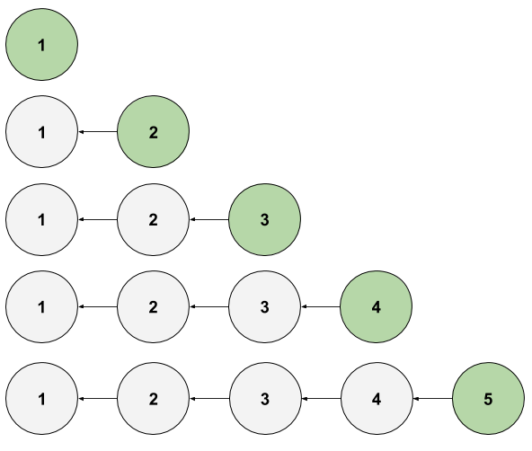
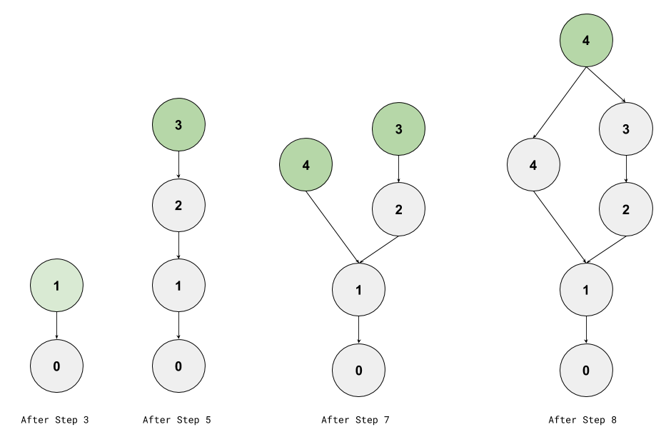
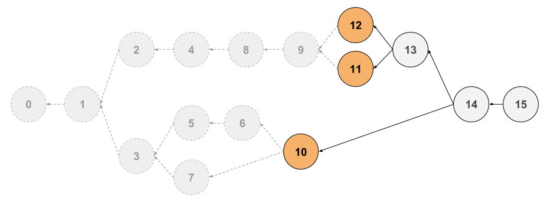

## The [`ipfs-log`](https://github.com/orbitdb/ipfs-log) package

> The funcionality provided by the [`ipfs-log`](https://github.com/orbitdb/ipfs-log) package is an implementation of a _Conflict-Free Replicated Data Type_ (CRDT) that utilizes IPFS's built in _directed acyclic graph_ (DAG) functionality to link data in a specific way. The functionality in this package forms the backbone of orbit-db.

<div>
  <h3>Table of Contents</h3>

* [The Conflict-Free Replicated Data Type (CRDT)](#the-conflict-free-replicated-data-type-CRDT)
* [Lamport Clocks](#lamport-clocks)
* [Heads and Tails](#heads-and-tails)

</div>

### The Conflict-Free Replicated Data Type (CRDT)

In the [previous chapter](../01_IPFS_Firmament.md) we discussed how we can use IPFS's _directted acyclic graph_ (DAG) functionality to create linked data structures. OrbitDB utilizes this by building logs wherein each entry is linked to the previous one. To share state reliably between users, and to prevent the system from being confused as to how to parse these logs deterministically, a specific type of data structure called a _Conflict-Free Replicated Data Type_, or CRDT is used.

A CRDT is a type of log that solves the problem of locally storing and ultimately merging distributed data sets to other distributed data sets<sup>1</sup>. CRDTs allows users to perform operations on local databases with the intent of merging or joining those data with the data stored on the devices of other peers in the network.

The [`ipfs-log`](https://github.com/orbitdb/ipfs-log) package specifically uses a G-Set CRDT, which in practice means append-only with no deletion.

```JavaScript
class GSet {
  constuctor (values) {}
  append (value) {}
  merge (set) {}
  get (value) {}
  has (value) {}
  get values () {}
  get length () {}
}
```

### Lamport Clocks

To achieve successful merging - merging that is properly associative and deterministic - entries are timestamped with something called a Lamport Clock<sup>2</sup>. The timestamp of each entry is a pair of values: a logical clock counter of the entry (as opposed to wall clock), and an identifier of the user or device that generated the entry.

In the case of /, the identifier is the public key of the IPFS node where the entries are initially generated.

```json
// Lamport Clock Object
{
  "id": "042750228c5d81653e5142e6a56d55...e5216b9a6612dbfc56e906bdbf34ea373c92b30d7",
  "time": 0
}
```

> **Note:** The "time" field is a monotonically increasing integer that increments each time a new entry is added to the log. It is not "wall time", e.g. a unix timestamp.

### Heads and Tails

Heads and Tails are important concepts in terms of CRDTs, and many people require a bit of explanation before fully understanding the concept and its implications.

#### Heads

The head of a log is an entry that is not referenced by any other entry. Practically speaking, these are the latest entries being appended to a log or logs.

This is best understood by example, observing how the heads change over time. In the following examples, circles are entries, green circles are heads, and arrows denote the pointers contained in the entry, to the previous record.

Let's start with the simplest example - a single user writing entries to a single log.



However, we are not in the business of single-device / single-user logs, so let's imagine the following scenario in an attempt to find the least-complex, but still complete example of how the heads would work over time.

First, in plain words and some pseudocode:

1. User 1 starts a Log (`log1 = new Log`)
2. User 2 starts a Log (`log2 = new Log`)
3. User 1 adds two entries to the log (`log1.append`)
4. User 2 merges that log with their own (`log2.join(log1)`)
5. User 1 adds two more entries (`log1.append`)
6. User 2 adds an entry (`log2.append`)
7. User 2 merges the log again (`log2.join`)
8. User 2 adds one more entry (`log2.append`)

Now in a diagram:



We can then see how it's possible that a CRDT may have more than one head entry (maybe hundreds) and how those entries change over time with multiple users.

#### Tails

A CRDT of any size can be stored in IPFS. However, When performing computations on the data, it needs to be loaded into an "input array" (i.e. subset of the log) that exists in a finite memory space. The tails of such a log point to entries that are not in the input array.

For our example, let's imagine a log with hundreds of millions of entries. You don't have access to a supercomputing center so it's not feasible to load the log into memory. Thus, we use a partial traversal of the log, the tails of which contain the pointers to the next records to be traversed, if we so choose.

This concept is visualized below, with the dim entries signifying non-traversed, and the orange entries signifying tails.



### Anatomy of a Log Entry

`ipfs-log` entries are JSON objects that follow a specific schema to form linked lists, or "chains" in a (Directed Acyclic Graph) DAG. In doing so, IPFS can be utilized as an append-only operation log.

What follows is sort of a "minimum viable example" of such a log. Below the example is a field-by-field explanation of what's going on.

```JSON
[
  {
    "hash": "zdpuAmL9zAgC4KFdMWW6yjpEcSYTnBunjTeijHv8GTKrxoz7D",
    "id": "example-log",
    "payload": "one",
    "next": [],
    "v": 1,
    "clock": {
      "id": "04524f55b54154aa9ec5a54118821c666d19825c0b4e4e91fac387035dbf679803cbdc858b052558f75d5e52ed5b2c38b94d4f652ee63142bae91b95df3b36fe4b",
      "time": 1
    },
    "key": "04524f55b54154aa9ec5a54118821c666d19825c0b4e4e91fac387035dbf679803cbdc858b052558f75d5e52ed5b2c38b94d4f652ee63142bae91b95df3b36fe4b",
    "identity": {
      "id": "0281c2c485e5f03f006f8e7ccb34f4281d2d7ae7d8571660e745eb4e07b4d8f35d",
      "publicKey": "04524f55b54154aa9ec5a54118821c666d19825c0b4e4e91fac387035dbf679803cbdc858b052558f75d5e52ed5b2c38b94d4f652ee63142bae91b95df3b36fe4b",
      "signatures": {
        "id": "3045022100c7fe5bab3844e197cccc9dc0962977f0381b96acaf9518688a278e0f8ddbc78d0220137e7d154a076319fe418e24f4d861683cf6823f3f725d1f4eb30b17cb1f3fbe",
        "publicKey": "3044022043dc1a586910538cd534666d8c66599e6349e82c6ba7fe5bf4d43cfefc4a3e9f02205838a492371fee3f22e4aeeeda9d0f8c1176bf16f64139049b0c6b47d89a8e63"
      },
      "type": "orbitdb"
    },
    "sig": "3045022100e85408f20d8917eea076e091a64507c1115f9314cf8578b1c483810e82dc6b8902206649fea6407261157310ef59fc518bb902a7b32a9ddf55817a6010df004ed452"
  },
  {
    "hash": "zdpuAoGa1MseCvKwbk9xdGK6aNyB5JqdYX8WrkUA8UCz7fRut",
    "id": "example-log",
    "payload": {
      "two": "hello"
    },
    "next": [
      "zdpuAmL9zAgC4KFdMWW6yjpEcSYTnBunjTeijHv8GTKrxoz7D"
    ],
    "v": 1,
    "clock": {
      "id": "04524f55b54154aa9ec5a54118821c666d19825c0b4e4e91fac387035dbf679803cbdc858b052558f75d5e52ed5b2c38b94d4f652ee63142bae91b95df3b36fe4b",
      "time": 2
    },
    "key": "04524f55b54154aa9ec5a54118821c666d19825c0b4e4e91fac387035dbf679803cbdc858b052558f75d5e52ed5b2c38b94d4f652ee63142bae91b95df3b36fe4b",
    "identity": {
      "id": "0281c2c485e5f03f006f8e7ccb34f4281d2d7ae7d8571660e745eb4e07b4d8f35d",
      "publicKey": "04524f55b54154aa9ec5a54118821c666d19825c0b4e4e91fac387035dbf679803cbdc858b052558f75d5e52ed5b2c38b94d4f652ee63142bae91b95df3b36fe4b",
      "signatures": {
        "id": "3045022100c7fe5bab3844e197cccc9dc0962977f0381b96acaf9518688a278e0f8ddbc78d0220137e7d154a076319fe418e24f4d861683cf6823f3f725d1f4eb30b17cb1f3fbe",
        "publicKey": "3044022043dc1a586910538cd534666d8c66599e6349e82c6ba7fe5bf4d43cfefc4a3e9f02205838a492371fee3f22e4aeeeda9d0f8c1176bf16f64139049b0c6b47d89a8e63"
      },
      "type": "orbitdb"
    },
    "sig": "304402207cb815276e16d222759f65558d22c3067b54be86f1ce66f1be057e7c188367d6022050e4b93ddc40bc174b725623473a00412cb56180254c18ec34b616afe4ef1840"
  }
]
```

* **hash**: the hash of the entry, in cidv1 format (this will switch to base32 soon)
* **id**: the user-supplied ID of the log
* **payload**: the actual content of the log entry, can be any JSON-serializable object
* **next**: an array of hashes that point to previous log entries from the _head_ of the log.
* **v**: the version of the log schema. Typically for internal tracking only and migration purposes
* **clock** the lamport clock values. explained above
* **key** the orbitdb-generated public key for verification purposes
* **identity** the identity object. defaults to the standard OrbitDB identity but can be customized
* **sig** the signaure of the entry, signed by the orbitdb private key, for verification purposes

#### References

1. <https://citemaster.net/get/10b50274-7bc5-11e5-8aa1-00163e009cc7/p558-lamport.pdf>
2. <https://hal.inria.fr/inria-00555588>
